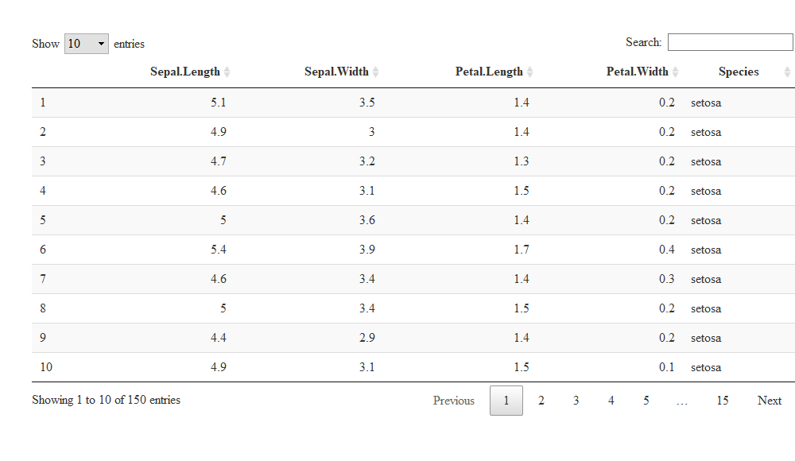

예측모델
================
Jimin KIM
2021-06-11

-   [분석모델 분석기간](#분석모델-분석기간)
    -   [분석기간 정의](#분석기간-정의)
    -   [분석기간 정의](#분석기간-정의-1)

## 분석모델 분석기간

### 분석기간 정의

-   타겟기간 : 3개월
-   학습기간 : 12개월
-   검증기간 : 12개월

### 분석기간 정의

| 작업년월 |     타겟기간     | 기준년월 |     학습기간     |     검증기간     |
|:--------:|:----------------:|:--------:|:----------------:|:----------------:|
|  202104  | 202101 \~ 202103 |  202012  | 202001 \~ 202012 | 201901 \~ 201912 |

#### DT datatable

<!-- -->

#### toc test

    ## [1] "toc 테스트 중입니다."
